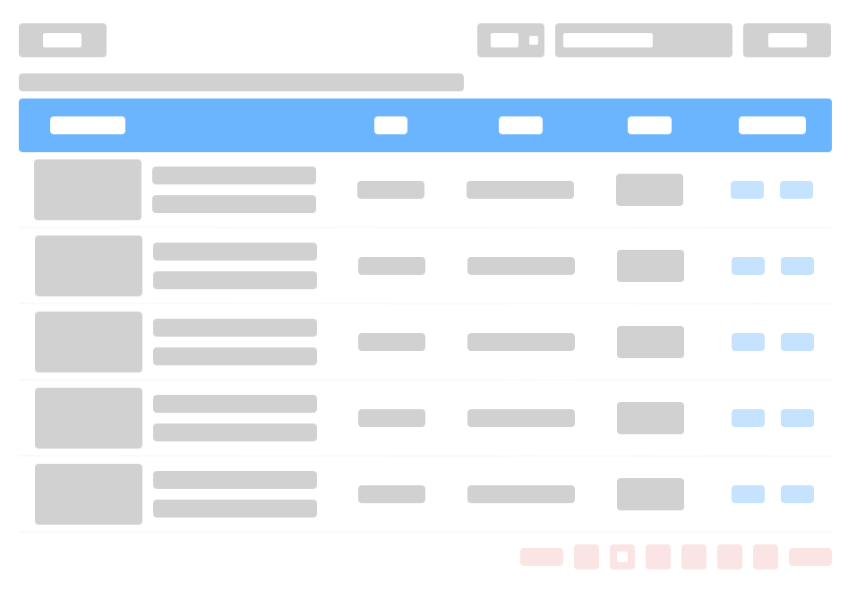

# Cding Table ｜ 表格快速成型工具

Cding Table，一个为开发者准备的基于 Vue 3.0 和 Element Plus 的数据表格组件库。

This is an element-Puls table component that can be configured to perform complex operations on the table.

<p>
    
    
    
    
    
    <a href="https://codecov.io/gh/notbucai/cding-table">
      
    </a>
</p>

<!--  -->


## 🤪 Installation

### Using Package Manager 
```bash
# NPM
$ npm install cding-table --save

# Yarn
$ yarn add cding-table
```
### Import in Browser
### UMD
```html
<!-- Import element-plus style -->
<link rel="stylesheet" href="//unpkg.com/element-plus/dist/index.css" />
<!-- Import Vue 3 -->
<script src="//unpkg.com/vue@next"></script>
<!-- Import component element-plus -->
<script src="//unpkg.com/element-plus"></script>

<!-- Import component cding-table -->
<script src="//unpkg.com/cding-table/lib/index.full.min.js"></script>
```

## 😵 Usage
### `webpack` or `rollup`

最小使用
```javascript
// import cding-table
import { TableData } from 'cding-table'

// 使用
<table-data :columns="columns" :load-method="loadMethod" />

// 列名
const columns = [
  {
    prop: 'id',
  }, {
    prop: 'name',
    label: '片名',
  }, {
    prop: 'release',
    label: '发行日期',
  },
  {
    prop: 'director',
    label: '导演',
  },
  {
    prop: 'runtime',
    label: '时长（分）',
  },
];

// 加载函数
async function loadMethod ({ page, sort }) {
  return new Promise(r => {
    setTimeout(() => {
      r(1)
    }, 300)
  }).then(() => {
    return {
      total: 100,
      list: [
        {
          id: 1,
          name: 'Toy Story',
          release: '1995-11-22',
          director: 'John Lasseter',
          runtime: 80,
        },
        {
          id: 2,
          name: "A Bug's Life",
          release: '1998-11-25',
          director: 'John Lasseter',
          runtime: 95,
        },
      ]
    }
  })
}
```

## 🌚 Options
参数 config 可参考 ElTable 参数 额外参数将标记

```ts
{
  size: {
    type: String as PropType<'mini' | 'medium' | 'small'>,
    default: 'medium',
  },
  config: {
    type: Object as PropType<ConfigType<any>>,
  },
  initLoad: {
    type: Boolean,
    default: true,
  },
  loadMethod: {
    required: true,
    type: Function as PropType<(event: { page: { pageIndex: number; pageSize: number; }; sort?: { [key: string]: any; }; }) => Promise<{
      total: number
      list: any[]
    }>>,
  },
  loadTree: {
    type: Function as PropType<(row: any, treeNode: TreeNode, resolve: (data: any[]) => void) => void>,
  },
  columns: {
    type: Object as PropType<ColumnType[]>,
  },
}

type Config = {
  stripe?: boolean
  height?: string | number
  maxHeight?: string | number
  size?: string
  width?: string | number
  fit?: boolean
  border?: boolean
  rowKey?: string | ((row: T) => string)
  showHeader?: boolean
  showSummary?: boolean
  sumText?: string
  summaryMethod?: SummaryMethod<T>
  rowClassName?: ColumnCls<T>
  rowStyle?: ColumnStyle<T>
  cellClassName?: CellCls<T>
  cellStyle?: CellStyle<T>
  headerRowClassName?: ColumnCls<T>
  headerRowStyle?: ColumnStyle<T>
  headerCellClassName?: CellCls<T>
  headerCellStyle?: CellStyle<T>
  highlightCurrentRow?: boolean
  currentRowKey?: string | number
  emptyText?: string
  expandRowKeys?: any[]
  defaultExpandAll?: boolean
  defaultSort?: Sort
  tooltipEffect?: string
  spanMethod?: (data: {
    row: T
    rowIndex: number
    column: TableColumnCtx<T>
    columnIndex: number
  }) =>
    | number[]
    | {
      rowspan: number
      colspan: number
    }
  selectOnIndeterminate?: boolean
  indent?: number
  treeProps?: {
    hasChildren?: string
    children?: string
  }
  lazy?: boolean
  load?: (row: T, treeNode: TreeNode, resolve: (data: T[]) => void) => void
  className?: string
  style?: CSSProperties
}
```

## Todos

+ [x] 静态数据渲染  

+ [x] 动态加载数据  

+ [x] 数据分页

+ [ ] 测试覆盖率

+ [ ] 长数据优化

+ [ ] other...